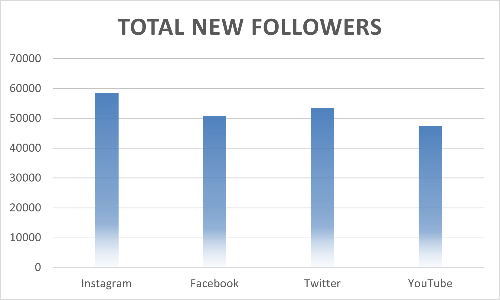
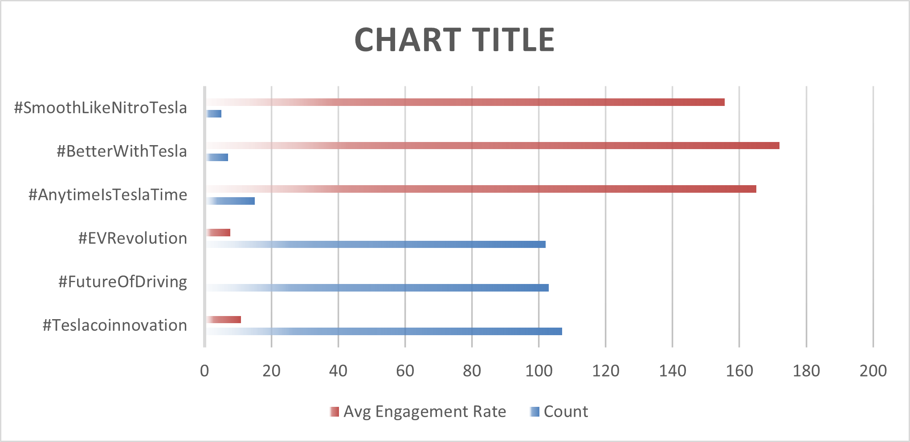
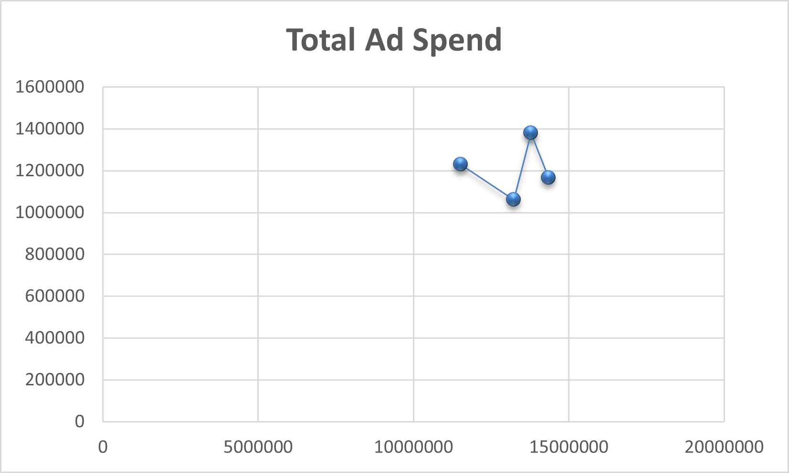

# ⚡ **ELECTRIC–INSIGHTS**
### *Tesla Social Media Data Analysis Project* 💫  

---
## 🌷 Overview
This project is a **Data Analysis project work** focused on exploring **Tesla’s social media performance** across different platforms.  
The goal was to understand how Tesla’s audience interacts with its posts, what type of content drives engagement, and how ad spend correlates with response.

I built this as part of my data analytics learning journey, combining Excel data cleaning, visualization, and analysis in one cohesive study.

---
## 📊 Objectives
- Analyze social media engagement patterns for Tesla posts  
- Identify high-performing campaigns and hashtags  
- Study the relationship between **ad spend** and **engagement rate**  
- Compare platform-wise performance and follower growth trends  
- Derive actionable insights to improve campaign strategy  

---
## 🧰 Tools Used
| Tool | Purpose |
|:------|:---------|
| **Microsoft Excel** | Data cleaning, KPI dashboards, pivot analysis |
| **Formulas** | Engagement rate, growth %, averages, correlations |
| **Charts & Visualization** | For content performance, platform trends |
| **Data Sources** | Provided project dataset (public / educational use) |

---
## 🪄 Workflow Summary
| Step | Description |
|------|--------------|
| 1️⃣ | Cleaned and structured raw data (removed duplicates, formatted columns) |
| 2️⃣ | Created engagement metrics (likes, shares, comments, total reach) |
| 3️⃣ | Conducted campaign-level and hashtag-level performance analysis |
| 4️⃣ | Visualized trends (weekly follower growth, engagement uplift, ad spend correlation) |
| 5️⃣ | Compiled final insights and recommendations |

---

## 💫 Key Insights
> *“Numbers tell stories — you just have to listen gently.”*

✨ **Instagram** showed the highest engagement rate overall.  
📈 **Product-centered campaigns** (#ModelY, #Cybertruck) consistently outperformed others.  
💰 A strong **positive correlation (~0.78)** was found between ad spend and engagement uplift.  
🌿 Consistency in posting frequency led to gradual follower growth across all platforms.  

---

## 📁 File Contents
| File | Description |
|:------|:-------------|
| `Tesla_Social_Analysis.xlsx` | Full dataset, analysis sheets, and dashboard |
| `images/` | Exported visualizations (engagement charts, correlations, etc.) |
| Presentation summary (if added) |

---
## 🖼️ Preview

---

## 🎯 Outcome
A structured understanding of how **Tesla’s social media strategy performs** across platforms —  
turning raw engagement data into insights that can help improve content focus and budget efficiency.
---
## 🩵 Reflection
This was my first end-to-end **data analysis project** where I applied:
- Excel data cleaning  
- Engagement KPI creation  
- Correlation & performance metrics  
- Dashboard building and reporting  

It helped me practice real analytical thinking — from identifying patterns to summarizing stories with visuals.

> *“Data can be logical and still feel alive — that’s what makes it beautiful.”* 🌸  
---
## 🌼 Credits
- Project Work by **Lakshita Sharma**  
- MCA (Data Analytics specialization)  
- Tools: Excel, Visualization, Analytical Reasoning  
- Date: October 2025  
---
✨ *“Even in numbers, there’s art.”*  
